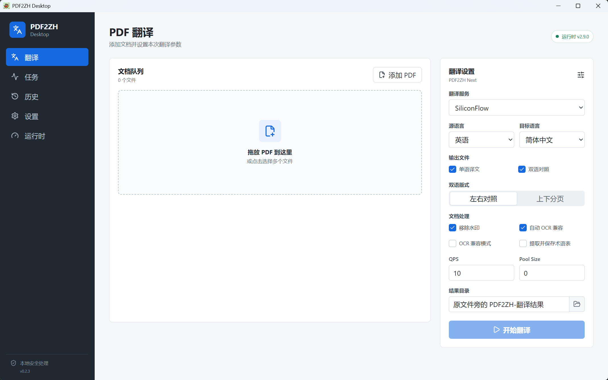
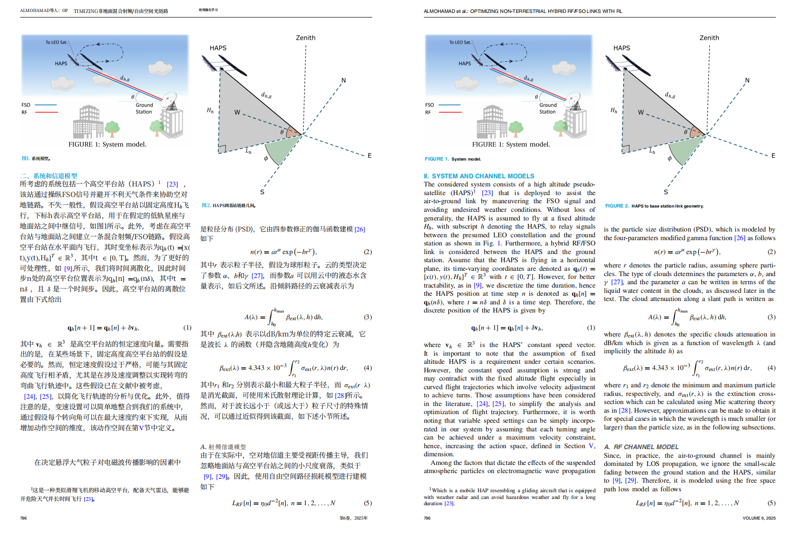

<div align="center">


# PDF2ZH Desktop

无需 Zotero 和 Python 的 Windows PDF 翻译桌面客户端

[](https://github.com/kd14125/pdf2zh-desktop/releases)
[](https://github.com/kd14125/pdf2zh-desktop/releases/tag/desktop-v0.4.0)
[](./LICENSE)
[](https://github.com/guaguastandup/zotero-pdf2zh)

[](https://github.com/kd14125/pdf2zh-desktop/releases/download/desktop-v0.4.0/PDF2ZH-Desktop-Setup-0.4.0.exe)

**普通用户只需下载并运行 `.exe`，不需要下载 `.sha256` 文件。**

[查看版本说明](https://github.com/kd14125/pdf2zh-desktop/releases/tag/desktop-v0.4.0)
· [SHA-256 校验文件（高级用户可选）](https://github.com/kd14125/pdf2zh-desktop/releases/download/desktop-v0.4.0/PDF2ZH-Desktop-Setup-0.4.0.exe.sha256)

</div>

> [!TIP]
> **v0.4.0 升级 MinerU 矢量公式增强。** 行间公式继续用于补充 PDF2ZH 漏检区域；包含分式、
> 积分等结构的复杂行内公式会使用 MinerU LaTeX 生成矢量对象，以真实宽高参与 BabelDOC 排版，
> 再写回 PDF。默认使用内置 MathJax，无需安装 LaTeX；也可切换本机 LaTeX 兼容特殊公式。

### v0.4.0 更新摘要

- 使用内置 MathJax 4 将 MinerU 识别出的复杂行内公式重绘为矢量对象，无需安装 LaTeX
- 公式以真实宽度、高度和基线作为不可拆分单元参与 BabelDOC 排版，减少拆散、残片和正文遮挡
- 保留可选的本机 LaTeX 模式，支持检测 `pdflatex`，并可通过 `winget` 安装 MiKTeX
- MathJax 单个公式渲染失败时，可在检测到本机 LaTeX 后逐公式回退
- 设置页增加公式渲染器选择、LaTeX 检测和安装状态，历史任务继续支持按原配置优化公式
- 已使用真实论文完成关闭/开启 MinerU 的同参数对照测试，单语和双语输出均可正常打开

## 界面预览

**PDF 翻译工作台：拖入文档后可集中设置翻译服务、语言、输出格式、OCR、QPS 和结果目录。**



**双语 PDF 输出：保留原始论文的公式、图表和版面，并提供译文与原文对照。**



## 项目简介

PDF2ZH Desktop 将 [PDFMathTranslate Next](https://github.com/PDFMathTranslate-next/PDFMathTranslate-next)
封装为可直接操作的 Windows 图形界面。安装应用、准备一次运行时并配置翻译服务后，即可拖入
PDF 进行单语或双语翻译，不需要安装 Zotero、Python、uv 或 conda。

桌面端代码位于 [`desktop/`](./desktop/)。仓库中的 Zotero 插件、Server 和原有文档来自上游
项目，予以保留以便追溯来源及继续遵守开源许可证。

> [!IMPORTANT]
> 本仓库是 [guaguastandup/zotero-pdf2zh](https://github.com/guaguastandup/zotero-pdf2zh)
> 的 fork，PDF2ZH Desktop 是在其基础上开发的独立衍生版本，不是上游作者发布或维护的官方
> 桌面客户端。桌面版问题请提交到[本仓库 Issues](https://github.com/kd14125/pdf2zh-desktop/issues)，
> 不要占用上游项目的支持渠道。

## 主要功能

- PDF 拖放、多选和批量队列，默认按顺序执行任务
- 自由选择源语言和目标语言，支持单语、双语、左右对照和上下对照
- 支持水印、OCR 兼容、术语表、QPS、Pool Size 和自定义输出目录
- 展示翻译阶段、百分比、耗时和日志摘要，支持取消、失败重试和移出队列
- 保存本地历史记录，支持 PDF 预览、打开文件、定位目录和按原配置重试
- 支持 SiliconFlowFree、OpenAI、AliyunDashScope、DeepSeek、SiliconFlow、Zhipu、
  OpenAICompatible 和 Anthropic Messages
- 同一服务可保存多组独立 API 配置，点击左侧配置即可切换当前翻译服务
- 使用当前配置获取完整模型列表并通过独立下拉框选择，同时保留手动输入模型名称
- 在设置页手动检查、下载并重启安装 GitHub Release 新版本
- 首次启动自动下载固定版本运行时，后续应用更新直接复用，无需重复下载
- API Key 通过 Electron `safeStorage` 和 Windows DPAPI 加密保存
- Anthropic Messages 通过仅监听本机回环地址的短生命周期适配器接入，不对外开放端口
- OpenAICompatible 根地址会自动补全 `/v1`；任务通过本机适配器移除中转站可能拦截的
  OpenAI Python SDK 请求头
- SiliconFlowFree 自动启用富文本兼容模式，避免内部样式标签进入翻译正文
- 可在设置页一键接入 Codex MCP，无需打开桌面窗口即可提交任务、查询进度和获取结果
- 可选 MinerU 矢量公式增强：补充漏检行间公式，并重绘容易拆散或遮挡的复杂行内公式
- 内置 MathJax 4 矢量渲染无需额外安装，也可检测或一键安装 MiKTeX 后切换本机 LaTeX
- 支持从历史任务复用原始 PDF、翻译配置和参数生成 `.mineru-formula.pdf`，不覆盖原结果

## 快速开始

### 1. 安装应用

系统要求为 Windows 10/11 x64。点击下方链接下载并运行安装包：

**[直接下载 PDF2ZH Desktop 安装包（`.exe`）](https://github.com/kd14125/pdf2zh-desktop/releases/download/desktop-v0.4.0/PDF2ZH-Desktop-Setup-0.4.0.exe)**

普通用户不需要下载或处理 SHA-256 文件。安装完成后直接启动 PDF2ZH Desktop，软件会通过
图形界面完成后续运行时下载和校验。

当前安装包未进行商业代码签名，Windows SmartScreen 可能显示“未知发布者”。请从本仓库
Release 下载。需要手动验证文件完整性的高级用户，可以使用 Release 中附带的 SHA-256
校验文件；这不是安装或运行的必要步骤。

### 2. 准备翻译运行时

首次启动后按“运行时”页面提示准备约 630 MiB 的官方 `with-assets-win64` 运行时。下载、
SHA-256 校验和解压均由软件自动完成，不需要在浏览器中另外下载文件；下载中断可以继续，
校验失败的文件不会被执行。

运行时与桌面应用版本分开保存。桌面应用升级后会自动发现并复用已经安装的同版本运行时；即使
旧版状态文件缺失或目录名称发生变化，也会先扫描完整安装目录，不会直接重新下载。

当前固定版本：

| 组件                  | 版本    |
| --------------------- | ------- |
| PDFMathTranslate Next | `2.9.0` |
| BabelDOC              | `0.6.3` |

运行时更新不会静默进行，需要用户手动检查并确认。

### 3. 配置翻译服务

在“设置”页面新增服务配置，填写 API Key、Base URL 和模型等必要信息，然后点击“测试连接”。
测试连接会真实调用服务商接口，可能产生少量费用。

每条配置拥有独立的 API Key、Base URL 和模型。保存后可在左侧列表中点击切换当前翻译服务，
不会覆盖其他配置。点击“获取模型”后，接口返回的全部模型会进入独立下拉框；选择结果会同步到
仍可手动编辑的模型输入框。
保存的 API Key 使用 Windows DPAPI 加密保存在本机，重启应用后仍可继续使用。

### 4. 配置 MinerU 矢量公式增强（可选）

需要优化公式漏检、拆散或遮挡时，在“设置”页面的“MinerU 矢量公式增强”区域填写 API 地址
和 Token，选择 `vlm` 或 `pipeline` 模型后测试连接并保存。Token 可在
[MinerU Token 管理页](https://mineru.net/apiManage/token)登录后创建或复制，保存后使用 Windows
DPAPI 加密存储在当前电脑。

公式渲染器默认选择“内置 MathJax”，不需要安装其他软件。MinerU 返回的复杂行内公式会生成纯
矢量 SVG/PDF，并作为不可拆分单元参与 BabelDOC 中文排版。遇到自定义宏或 MathJax 不支持的
语法时，可选择“本机 LaTeX”；设置页会检测 `pdflatex`，缺失时可通过 `winget` 安装 MiKTeX。
LaTeX 编译关闭 Shell Escape，并拒绝文件读写等危险命令。

回到“翻译”页面，勾选“MinerU 矢量公式增强”即可在翻译前进行公式分析。已有翻译任务可在
“历史”页面点击“优化公式”，应用会查找历史中保留的原始 PDF，并按原配置重新生成带有
`.mineru-formula.pdf` 后缀的结果，不会覆盖原文件。原始 PDF 已移动或删除时无法重新生成。

启用该功能会把原始 PDF 上传到 MinerU，可能消耗 MinerU 配额并增加处理时间；重新生成也可能
再次调用翻译服务并产生费用。普通文档或公式已经正常时可以保持关闭。点击开关右侧的帮助图标，
可在应用内查看工作原理和 Token 获取步骤。

### 5. 应用更新

安装支持自动更新的版本后，可在“设置”页面点击“检查更新”。发现 GitHub Release 新版本时，
应用会显示“下载更新”，下载完成后点击“重启安装”即可完成升级。更新不会静默下载或安装。

从不支持自动更新的旧版本升级时，需要最后一次手动下载安装包；之后即可使用应用内更新。

SiliconFlowFree 不需要 API Key，适合快速体验；需要更稳定或更高质量的结果时，可配置自己的
翻译服务。QPS 表示每秒请求数，Pool Size 表示并行处理规模，请以服务商的限流规则为准，
不确定时保持默认值或只设置 QPS。

### 6. 翻译 PDF

进入“翻译”页面，拖入一个或多个 PDF，选择语言、输出样式和输出目录后点击“开始翻译”。默认
结果目录为原 PDF 旁的 `PDF2ZH-翻译结果`；同名文件会自动追加序号，不会静默覆盖已有结果。

### 7. 使用 Codex MCP

1. 先在桌面端完成运行时和翻译服务配置。
2. 打开“设置”，在“Codex MCP”区域点击“接入 Codex”。
3. 新建一个 Codex 任务，即可用自然语言调用 PDF2ZH。

示例：

```text
使用当前 PDF2ZH 配置，把 D:/papers/paper.pdf 翻译成中英双语，左右对照。
```

也可以要求 Codex 列出配置、查看任务进度、取消任务或按原参数重试。开始翻译后不需要保持
桌面窗口打开，MCP 创建的任务和结果仍会显示在桌面端历史中。首次调用会按 Codex 当前权限
设置请求工具执行确认，PDF2ZH 本身不会再增加第二次确认。

MCP 不提供 API Key 查询或修改工具。密钥仍由桌面端使用 Windows DPAPI 加密保存，MCP 只会
返回配置名称、服务类型、模型和是否已配置密钥。调用第三方翻译服务可能产生费用，执行前请确认
当前配置和服务商余额。

## 数据与安全

| 数据           | 默认位置或处理方式                                |
| -------------- | ------------------------------------------------- |
| 应用配置和历史 | `%APPDATA%/PDF2ZH Desktop`                        |
| 翻译运行时     | `%LOCALAPPDATA%/PDF2ZH Desktop/runtime`           |
| 翻译结果       | 原 PDF 旁的 `PDF2ZH-翻译结果`                     |
| API Key        | Electron `safeStorage` / Windows DPAPI 加密       |
| 临时任务配置   | 任务结束、失败、取消或异常退出后清理              |
| MCP 通信       | 当前 Windows 用户专属命名管道，不开放端口         |
| MinerU 增强    | 启用时原始 PDF 上传到用户配置的 MinerU API        |
| 公式渲染       | MathJax 在本机离线运行；可选 LaTeX 也仅在本机编译 |

PDF 文件由本机运行时处理；待翻译文本会按所选服务商的接口要求发送给相应服务商。请在使用前
阅读服务商的隐私政策和数据处理条款。日志、历史记录和诊断信息不会保存 API Key。

## 开发与构建

要求 Node.js 22 和 Windows 10/11 x64。

```powershell
cd desktop
npm install --ignore-scripts
npm run verify
npm run build
npm run test:ui
npm run package
```

安装包生成在 `desktop/release/`。更完整的开发说明见 [`desktop/README.md`](./desktop/README.md)。

## 开发与贡献

- [@kd14125](https://github.com/kd14125)：项目维护者，负责桌面端设计、功能规划、测试与发布
- [@codex](https://github.com/codex)：OpenAI Codex，协助桌面端代码实现、自动化测试与文档维护

## Fork 来源与引用说明

本仓库在上游
[`guaguastandup/zotero-pdf2zh@fccef4b`](https://github.com/guaguastandup/zotero-pdf2zh/tree/fccef4bcc6b9bfcba8a8e7be818f5798b4863f55)
基础上进行桌面化改造。上游项目实现了在 Zotero 中使用 PDF2zh 和 PDF2zh Next，并提供了
翻译服务配置、翻译选项、任务进度及结果处理等完整实践。

桌面版参考或复用了上游项目中的以下内容和设计思路：

- 翻译服务配置字段与 PDF2ZH Next 参数映射
- 单语/双语、对照布局、OCR、术语表、QPS 和 Pool Size 等选项定义
- 任务进度识别、输出文件命名和翻译结果管理思路
- 上游 README 中与翻译服务和翻译参数有关的说明，按桌面版实际行为重新整理

桌面版移除了 Flask、Base64 文件上传和 Zotero 附件处理流程，改为由 Electron 直接管理本地
PDF 路径及官方 Windows 运行时。所有修改均可在本仓库提交历史和 `desktop/` 源码中查看。

## 致谢

- [guaguastandup/zotero-pdf2zh](https://github.com/guaguastandup/zotero-pdf2zh) 及其作者
  [@guaguastandup](https://github.com/guaguastandup)：本仓库的 fork 来源和主要参考项目
- [PDFMathTranslate Next](https://github.com/PDFMathTranslate-next/PDFMathTranslate-next) 及其维护者：
  PDF 翻译运行时
- [BabelDOC](https://github.com/funstory-ai/BabelDOC)：文档解析与排版能力
- [MathJax](https://www.mathjax.org/)：默认的本地矢量公式渲染
- [zotero-plugin-template](https://github.com/windingwind/zotero-plugin-template)：上游 Zotero 插件模板

也感谢[上游项目贡献者](https://github.com/guaguastandup/zotero-pdf2zh/graphs/contributors)及上述
项目的所有贡献者。原项目的详细使用方式和支持渠道请以上游仓库为准。

## 许可证

本项目依据 [GNU Affero General Public License v3.0 or later](./LICENSE) 发布。分发本应用或其
修改版本时，请遵守 AGPL 的源码提供、版权及许可证保留等要求。

本仓库包含或下载的第三方组件仍分别受其各自许可证约束。运行时对应源码版本可在
[`desktop/runtime-manifest.json`](./desktop/runtime-manifest.json) 和应用“关于”页面中查看。
